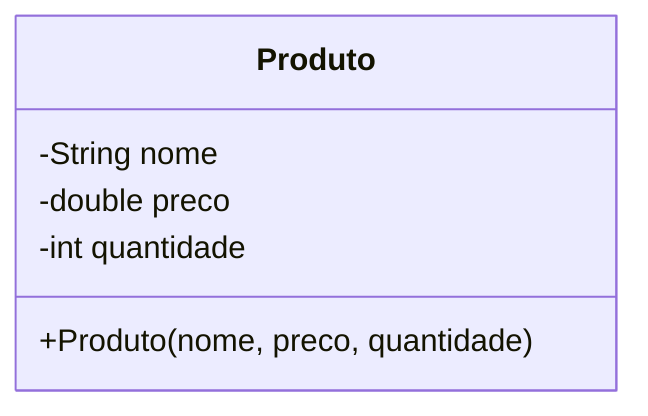
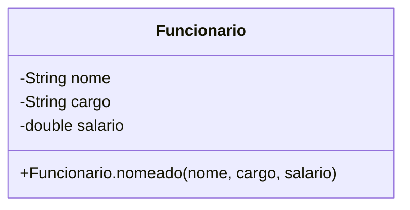
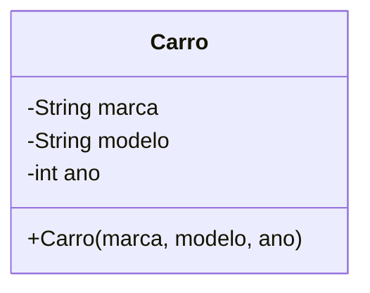
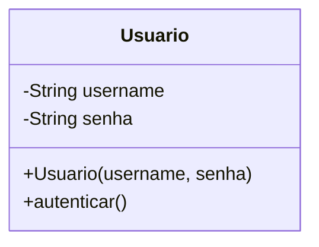
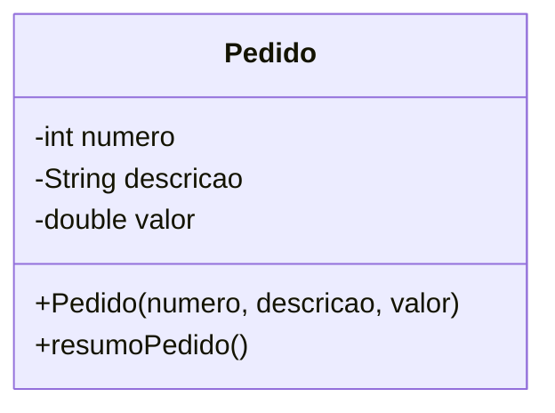

# 💻 Oficina 1

## Exercício 01

Crie uma classe `Produto` com atributos para nome, preço e quantidade. Use um construtor com parâmetros posicionais obrigatórios. No programa principal, instancie um produto e mostre seus dados.



<pre class="language-dart"><code class="lang-dart"><strong>void main() {
</strong>  Produto p1 = Produto('Notebook', 3500.0, 5);
  p1.exibir();

  // Crie outros produtos:
  // Produto p2 = Produto('Mouse', 80.0, 20);
}
</code></pre>

***

## Exercício 02

Crie a classe `Funcionario` com nome, cargo e salário. Use um **construtor nomeado** para instanciar objetos. No `main()`, exiba os dados de um funcionário.




```dart
void main() {
  Funcionario f1 = Funcionario.nomeado(nome: 'Ana', cargo: 'Gerente', salario: 7500.0);
  f1.exibir();

  // Crie outros funcionários:
  // Funcionario f2 = Funcionario.nomeado(nome: 'Carlos', cargo: 'Analista', salario: 5200.0);
}
```

***

## Exercício 03

Implemente a classe `Carro` com marca, modelo e ano. Use um construtor com **parâmetros opcionais nomeados** e defina valores padrão. Exiba os dados do carro.



```dart
void main() {
  Carro c1 = Carro(marca: 'Toyota', modelo: 'Corolla', ano: 2022);
  c1.exibir();

  // Crie outros carros:
  // Carro c2 = Carro(modelo: 'Fiesta');
}
```

***

## Exercício 04

Crie uma classe `Usuario` com nome de usuário e senha. Use um **construtor padrão**, e um método `autenticar` que verifica se a senha é "1234". No `main()`, instancie um usuário e teste a autenticação.



```dart
void main() {
  Usuario u1 = Usuario('joao123', '1234');
  u1.autenticar();

  // Crie outros usuários:
  // Usuario u2 = Usuario('maria456', 'abcd');
}
```

***

## Exercício 05&#x20;

Implemente a classe `Pedido` com número do pedido, descrição e valor total. Use um **construtor com `named parameters` obrigatórios** e um método `resumoPedido()`. Instancie um pedido no `main()`.



```dart
void main() {
  Pedido pedido1 = Pedido(numero: 101, descricao: 'Compra de livros', valor: 299.90);
  pedido1.resumoPedido();

  // Crie outros pedidos:
  // Pedido pedido2 = Pedido(numero: 102, descricao: 'Material escolar', valor: 120.00);
}
```

***

## Exercício 06

Escreva um programa que receba a idade de uma pessoa e verifique se ela é **maior de idade** (18 anos ou mais). Use um `if/else` para imprimir uma mensagem correspondente.

***

## Exercício 07

Utilize um laço `for` para imprimir todos os **números primos entre 1 e 100**.

***

## Exercício 08

Escreva um programa que recebe dois números e um operador (`+`, `-`, `*`, `/`) e realiza a operação correspondente. Utilize `if/else if` para definir a operação.

***

## Exercício 09

Utilize um laço `for` para somar todos os números entre 1 e 100 que sejam múltiplos de 3. Imprima o resultado ao final.

***

## Exercício 10

Crie um programa que receba um número inteiro e imprima a **tabuada de 1 a 10** desse número.

***

## Exercício 11

Declare uma variável `int? idade` que pode ser nula e atribua um valor de entrada simulada. Use o operador `??` para fornecer um valor padrão de 18 anos caso a variável seja nula. Imprima a idade final que será considerada para cadastro em um sistema.

***

## Exercício 12

Implemente um programa que declara uma variável `String? cidade` que inicialmente vale `null`. Use o operador `??=` para atribuir "São Paulo" apenas se `cidade` ainda estiver nula. Imprima o valor final da variável após essa operação.
